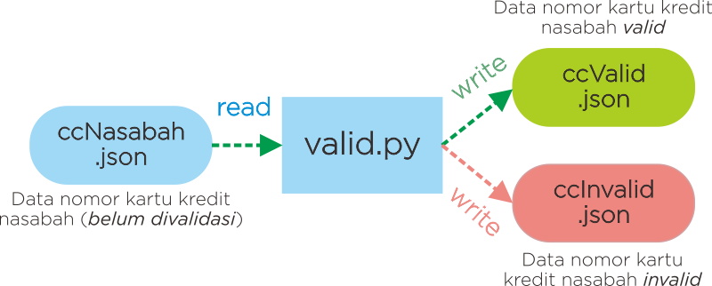

# Python Basic Exercises


#

### **Soal 1 - FPB & KPK**

Buatlah sebuah __file Python interaktif__ yang mengandung **sebuah function** untuk menentukan nilai **FPB** (_Faktor Persekutuan Besar_) & **KPK** (_Kelipatan Persekutuan Kecil_) dari 2 buah bilangan. Pembahasan seputar FPB & KPK pernah kita pelajari bersama di bangku Sekolah Dasar.

- __Case Flow__: Saat dieksekusi, program akan meminta user memasukkan 2 buah angka secara bebas. Kemudian user akan mendapatkan nilai FPB dan KPK dari 2 buah angka yang dimasukkan.

- Output yang diharapkan saat file diekseskusi via terminal:
  
  ```bash
  Ketik angka pertama     : 3
  Ketik angka kedua       : 2
  FPB dari 3 dan 2 adalah : 1
  KPK dari 3 dan 2 adalah : 6
  ```

- Contoh screenshot:

    

_**Catatan:**_ _Lampiran jawaban dalam bentuk file FpbKpk.py yang sudah diupload_

#

### **Soal 2 - Kategori Bilangan**

Buatlah sebuah __file Python__ yang mengandung **sebuah return function** untuk menentukan kategori bilangan sebuah angka. Misal: angka __13__ tergolong bilangan __*bulat*__, **_cacah_**, *__asli__*, **_ganjil_** & __*prima*__. Berikut adalah definisi & pengkategorian bilangan menurut laman Wikipedia [(klik di sini)](https://id.wikipedia.org/wiki/Bilangan):

- __Bilangan Bulat__: Bilangan yang terdiri atas bilangan cacah (0, 1, 2, 3, ...) beserta nilai negatifnya (0, -1, -2, -3, ...). Bilangan bulat dapat dituliskan tanpa komponen desimal atau pecahan.

- __Bilangan Cacah__: Himpunan bilangan bulat yang tidak bernilai negatif, yaitu (0, 1, 2, 3 ...).

- __Bilangan Negatif__: Himpunan bilangan bulat yang nilainya lebih kecil dari 0, yaitu (-1, -2, -3, ...)

- __Bilangan Nol__: Yaitu 0

- __Bilangan Asli__: Himpunan bilangan cacah positif yang bukan nol, yaitu (1, 2, 3, ...)

- __Bilangan Ganjil__: Himpunan bilangan asli positif yang nilainya tidak habis dibagi 2, yaitu (1, 3, 5, 7, 9, ...)

- __Bilangan Genap__: Himpunan bilangan asli positif yang nilainya habis dibagi 2, yaitu (2, 4, 6, 8, 10, ...). Bilangan nol (0) juga digolongkan sebagai bilangan genap.

- __Bilangan Prima__: Himpunan bilangan asli yang nilainya lebih besar daripada 1, yang faktor pembaginya adalah 1 dan bilangan itu sendiri. 2 dan 3 adalah bilangan prima. 4 bukan bilangan prima karena dapat dibagi 2.

- __Bilangan Komposit__: Himpunan bilangan asli yang nilainya lebih besar daripada 1, yang bukan merupakan bilangan prima.

  

- __Case Flow__: Saat dieksekusi, program akan meminta user memasukkan angka secara bebas. Kemudian user akan mendapatkan kategori bilangan dari angka yang dimasukkan, dalam bentuk __list__.

- Output yang diharapkan saat file diekseskusi via terminal:
  
  ```bash
  Ketik angka : 2
  ['bulat', 'cacah', 'asli', 'genap', 'prima']

  Ketik angka : 15
  ['bulat', 'cacah', 'asli', 'ganjil', 'komposit']
  ```

- Contoh screenshot:

    

_**Catatan:**_ _Lampiran jawaban dalam bentuk file KategoriBilangan.py yang sudah diupload_

#

### **Soal 3 - Fungsi Pangkat**

Buatlah __sebuah return function__ dengan __2 parameter__ yang dapat menghitung pangkat tertentu dari sebuah bilangan, __tanpa__ menggunakan operator __pangkat ( ** )__ , tanpa menggunakan fungsi __pow( )__ dan tanpa memanfaatkan __package/library manapun!__

- __Case Flow__: Saat dieksekusi, program akan mencetak nilai return function.

    ```python
    print(pangkat(2, 2))
    print(pangkat(3, 3))
    print(pangkat(10, 5))
    ```

- Output yang diharapkan saat file diekseskusi via terminal:
  
    ```bash
    4
    27
    100000
    ```

- Contoh screenshot:

    

_**Catatan:**_ 

✅ Buatlah sebuah return function dengan 2 parameter: __pangkat(x, y)__

❌ Dilarang menggunakan operator pangkat ( __**__ )

❌ Dilarang menggunakan fungsi pangkat __*pow( )*__

❌ Dilarang menggunakan package manapun seperti: __Math__, __Numpy__, __PyPi__, dll.

 _Lampiran jawaban dalam bentuk file PangkatSederhana.py yang sudah diupload_

#

### **Soal 4 - Membalik Posisi Elemen List**

Buatlah __sebuah return function__ dengan __1 parameter__ yang dapat membalik urutan elemen dari suatu list. Misal terdapat suatu list: __[1,2,3,4,5]__ maka function yang Anda buat dapat membalik urutan elemen list menjadi: __[5,4,3,2,1]__. Namun Anda __dilarang keras__ untuk menggunakan cara-cara berikut:

⭐ __Cara 1.__ *menggunakan* __reverse( )__ *method pada list*
```python
a = [1, 2, 3, 4]
a.reverse()
print(a)

// hasil = [4, 3, 2, 1]
```

⭐ __Cara 2.__ *menggunakan* __list slicing__ *syntax* ( __[ : : -1]__ )
```python
b = [5, 6, 7, 8]
print(b[::-1])

// hasil = [8, 7, 6, 5]
```

⭐ __Cara 3:__ *menggunakan* __reversed( )__ *function*
```python
c = [9, 10, 11, 12]
print(list(reversed(c)))

// hasil = [12, 11, 10, 9]
```

#

- __Case Flow__: Saat dieksekusi, program akan mencetak nilai return function, yakni membalik posisi elemen dari list yang dimasukkan sebagai nilai parameter function, misal:

    ```python
    print(balikPosisi([1, 2, 3, 4, 5, 6, 7, 8, 9]))
    print(balikPosisi(['A', 'B', 'C', 'D', 'E', 'F', 'G']))
    print(balikPosisi(['Messi', 'Suarez', 'Coutinho', 'Dembele', 'Rakitic']))
    ```

- Output yang diharapkan saat file diekseskusi via terminal:
  
    ```bash
    [9, 8, 7, 6, 5, 4, 3, 2, 1]
    ['G', 'F', 'E', 'D', 'C', 'B', 'A']
    ['Rakitic', 'Dembele', 'Coutinho', 'Suarez', 'Messi']
    ```

- Contoh screenshot:

    

_**Catatan:**_ 

✅ Buatlah sebuah return function dengan 1 parameter: __balikPosisi(x)__

❌ Dilarang menggunakan __reverse( )__ list method

❌ Dilarang menggunakan __list slicing syntax [ : : -1]__

❌ Dilarang menggunakan __reversed( )__ function

_Lampiran jawaban dalam bentuk file BalikPosisi.py yang sudah diupload_

#

### **Soal 5 - 🔴🔵 Himpunan**

Diketahui:
- A = himpunan (_set_) bilangan __genap__ antara __1__ dan __20__.
- B = himpunan (_set_) bilangan __ganjil__ antara __1__ dan __20__.
- C = himpunan (_set_) bilangan __negatif__ lebih dari __-10__.
- D = himpunan (_set_) bilangan __prima__ antara __1__ dan __20__.
- E = himpunan (_set_) bilangan __komposit__ antara __1__ dan __20__.

Definisi & kategori bilangan dapat Anda simak di laman [_Wikipedia_](https://id.wikipedia.org/wiki/Bilangan). Buatlah sebuah __file python__ (_.py_) yang dapat menyelesaikan permasalahan himpunan berikut:

__a.__ A ∪ B ∪ C ∪ D ∪ E

__b.__ (A ∩ B) ∪ (D ∩ E)

__c.__ (A ∪ B) ∩ (D ∪ E)

__d.__ (A ∪ B) - (D ∪ E)

__e.__ (A ∪ B ∪ C) - (A ∩ E)


_**Catatan:**_ _Lampiran jawaban dalam bentuk file FpbKpk.py yang sudah diupload_

#

### **Soal 6 - 📆 Tahun Kabisat**

__*Tahun kabisat*__ merupakan tahun yang mengalami penambahan satu hari dengan tujuan untuk menyesuaikan penanggalan dengan tahun astronomi. Dalam satu tahun tidak secara persis terdiri dari 365 hari, tetapi __*365 hari 5 jam 48 menit 45,1814 detik*__. Jika hal ini tidak dihiraukan, maka setiap empat tahun akan kekurangan hampir 1 hari. Maka untuk mengkompensasi hal ini, setiap 4 tahun sekali, diberi 1 hari ekstra: __29 Februari__. 

Buatlah sebuah file python interaktif (__*.py*__) berisi sebuah **_function_** yang dapat menentukan suatu input dari user tergolong tahun kabisat atau tidak. Saat file dieksekusi, user diminta memasukkan angka tahun tertentu, kemudian akan muncul hasil yang menyatakan input user tersebut tergolong tahun kabisat atau tidak. Contoh hasil yang diharapkan:

```bash
Input tahun : 2019
Hasil : BUKAN TAHUN KABISAT

Input tahun : 2020
Hasil : TAHUN KABISAT
```

_**Catatan:**_ _Lampiran jawaban dalam bentuk file TahunKabisat.py yang sudah diupload_

#

### **Soal 7 - 📧 Alamat Email**

Buatlah sebuah file python interaktif (__*.py*__) berisi sebuah **_function_** yang dapat menentukan suatu input dari user tergolong alamat email yang valid atau tidak. Adapun kriteria alamat email yang valid adalah sebagai berikut:

- Memiliki format: __*namaUser@namaHosting.ekstensi*__
- __*namaUser*__ hanya boleh terdiri atas huruf, angka, dash ('-') dan underscore ('_').
- __*namaHosting*__ hanya boleh terdiri atas huruf dan angka.
- __*ekstensi*__ hanya boleh terdiri atas huruf, dengan maksimum 5 karakter.

__Contoh__:

- ✅ Alamat email __*valid*__:
    - __lintangwisesa@ymail.com__
    - __lintang@purwadhika.com__
    - __lintang123@ironman123.space__

- ❌ Alamat email __*tidak valid*__:
    - __l/nt*ngw:s=s!@ym~il.com__
    - __lintang@purwadhika.community__
    - __lintang123@ironman123__

Saat file dieksekusi, user diminta memasukkan alamat email, kemudian akan muncul hasil yang menyatakan email user valid atau tidak. Contoh hasil yang diharapkan:

```bash
Input email : lintang@purwadhika.com
Hasil : EMAIL VALID

Input email : lintang123@ironman123.space
Hasil : EMAIL VALID

Input email : captain@l*nt*ng.id
Hasil : EMAIL TIDAK VALID
```

_**Catatan:**_ _Lampiran jawaban dalam bentuk file AlamatEmail.py yang sudah diupload_

#

### **Soal 8 - 🔺 Segitiga Kata**

Buatlah __sebuah file python__ (*.py*) yang mengandung __sebuah function__ dengan __1 parameter__, yang dapat membentuk pola segitiga dengan elemen berupa karakter-karakter dari sebuah __string__ yang menjadi parameter function tersebut. Info selengkapnya silakan ikuti case flow beserta output yang diharapkan berikut ini.

- __Case Flow__: Saat dieksekusi, program akan mencetak pola segitiga dari karakter-karakter string yang diinputkan. Jika jumlah karakter string memenuhi syarat terbentuknya pola, maka program akan menjalankannya. Namun jika jumlah karakter string tidak memenuhi syarat membentuk pola, maka akan muncul pesan bahwa string tidak memenuhi syarat membentuk pola.

    ```python
    segitigaKata('Purwadhika')
    segitigaKata('Purwadhika Startup and Coding School @BSD')
    segitigaKata('kode')
    segitigaKata('kode python')
    segitigaKata('lintang')
    ```

- __Output__ yang diharapkan:
  
    ```bash
    # segitigaKata('Purwadhika')
    P 
    u r     
    w a d   
    h i k a 
    p u r w 
    a d h   
    i k     
    a   

    # segitigaKata('Purwadhika Startup and Coding School @BSD')
    P
    u r
    w a d 
    h i k a
    S t a r t
    u p a n d C
    o d i n g S c
    h o o l @ B S D
    P u r w a d h i
    k a S t a r t
    u p a n d C
    o d i n g
    S c h o
    o l @
    B S 
    D

    # segitigaKata('kode')
    Mohon maaf, jumlah karakter tidak memenuhi syarat membentuk pola.

    # segitigaKata('kode python')
    k
    o d
    e p y
    t h o n
    k o d e
    p y t
    h o
    n

    # segitigaKata('lintang')
    Mohon maaf, jumlah karakter tidak memenuhi syarat membentuk pola.
    ```

_**Catatan:**_ _Lampiran jawaban dalam bentuk file SegitigaKata.py yang sudah diupload_

#

### **Soal 9 - 💳 Nomor Kartu Kredit**

Disediakan __sebuah file JSON__ (_ccNasabah.json_, unduh [di sini](https://raw.githubusercontent.com/LintangWisesa/Ujian_Fundamental_JCDS07/master/ccNasabah.json)) berisi data nomor kartu kredit nasabah sebuah bank, yang belum diverifikasi validitas kartu kreditnya. Buatlah __sebuah file python__ (*.py*) yang dapat membaca file JSON tersebut, kemudian memisahkan antara nasabah dengan nomor kartu kredit valid & invalid, lalu menyimpan hasilnya dalam file JSON yang terpisah (_ccValid.json_ dan _ccInvalid.json_). Skema kerjanya dapat diilustrasikan sebagai berikut:



# 

Adapun kriteria nomor kartu kredit yang valid adalah sebagai berikut:

- Diawali dengan angka __4__, **5** atau __6__.
- Terdiri atas tepat __16 digit__ angka.
- Hanya mengandung angka __0-9__.
- Boleh dituliskan berupa grup __4 digit__ yang dipisahkan dengan tanda hubung __"-"__
- Tidak boleh terdapat 1 angka yang diulang __>3x__ & tertulis secara beruntun, misal: 3333.

__Contoh__:
- ✅ Nomor kartu kredit __*valid*__:
    - __4253625879615781__
    - __4424424424442442__
    - __5122-2368-7954-3213__
    - __4123456789123454__
    - __5123-4567-8912-3455__
    - __4123356789123456__

- ❌ Nomor kartu kredit __*invalid*__:
    - __0525362587961578__ &nbsp;&nbsp;&nbsp;(tidak diawali dengan 4, 5 atau 6)
    - __42536258796157867__ &nbsp;&nbsp;&nbsp;(terdiri atas __17 digit__ angka)
    - __44244z4424442444__ &nbsp;&nbsp;&nbsp;(terdapat karakter __'z'__ yang bukan angka)
    - __5122.2368.7954.3214__ &nbsp;&nbsp;&nbsp;(dipisahkan bukan dengan tanda hubung)
    - __4424444424442444__ &nbsp;&nbsp;&nbsp;(terdapat angka yang diulang __>3x__ & tertulis secara beruntun, yaitu: __44444__)
    - __61234-123-8912-3456__ &nbsp;&nbsp;&nbsp;(terdapat grup yang tidak hanya terdiri atas 4 digit angka)
    - __5199-9967-7912-3457__  &nbsp;&nbsp;&nbsp;(terdapat angka yang diulang __>3x__ & tertulis secara beruntun, yaitu: __9999__)
    - __5123 - 4567 - 8912 - 3456__ &nbsp;&nbsp;&nbsp;(dipisahkan dengan tanda hubung & spasi)

__Output__ yang diharapkan:
- File __*ccValid.json*__ berisi data nasabah dengan nomor kartu kredit yang valid:
    ```json
    [
        {"nama": "Andi", "noCreditCard": "4253625879615781"},
        {"nama": "Budi", "noCreditCard": "5123-4567-8912-3455"},
        {"nama": "Euis", "noCreditCard": "4424424424442442"},
        {"nama": "Inne", "noCreditCard": "5122-2368-7954-3213"},
        {"nama": "Nuri", "noCreditCard": "4123356789123456"},
        {"nama": "Opik", "noCreditCard": "4123456789123454"}
    ]
    ```
- File __*ccInvalid.json*__ berisi data nasabah dengan nomor kartu kredit yang tidak valid:
    ```json
    [
        {"nama": "Caca", "noCreditCard": "0525362587961578"},
        {"nama": "Deni", "noCreditCard": "42536258796157867"},
        {"nama": "Fani", "noCreditCard": "44244z4424442444"},
        {"nama": "Gaga", "noCreditCard": "5122.2368.7954.3214"},
        {"nama": "Hari", "noCreditCard": "4424444424442444"},
        {"nama": "Janu", "noCreditCard": "61234-123-8912-3456"},
        {"nama": "Kiki", "noCreditCard": "5199-9967-7912-3457"},
        {"nama": "Luis", "noCreditCard": "1111222233334444"},
        {"nama": "Mira", "noCreditCard": "5123 - 4567 - 8912 - 3456"}
    ]
    ```

_**Catatan:**_ 

✅ Pastikan Anda membuat sebuah file python yang dapat membaca _ccNasabah.json_, kemudian memisahkan antara nasabah dengan kartu kredit valid & kartu kredit invalid, lalu menyimpannya dalam dalam file JSON yang terpisah (_ccValid.json_ dan _ccInvalid.json_). 

✅ _Lampiran jawaban dalam bentuk file KartuKredit.py serta ccValid.json dan ccInvalid.json yang sudah diupload_

#

### **Soal 10 🏁 Challenge**


Buatlah sebuah file spreadsheet/excel (__.xlsx__) yang pada sel __A1:C3__ berisi angka seperti pada ilustrasi di atas. Tugas Anda, buatlah sebuah file python (__.py__) yang dapat membaca file excel tersebut, kemudian menyimpannya kembali di sheet 2, 3 & 4 pada file yang sama, namun dengan konfigurasi angka yang berbeda. Perhatikan ilustrasi di atas 👆

✅ _Lampiran jawaban dalam bentuk file challenge.py serta challenge.xlsx yang sudah diupload_

#